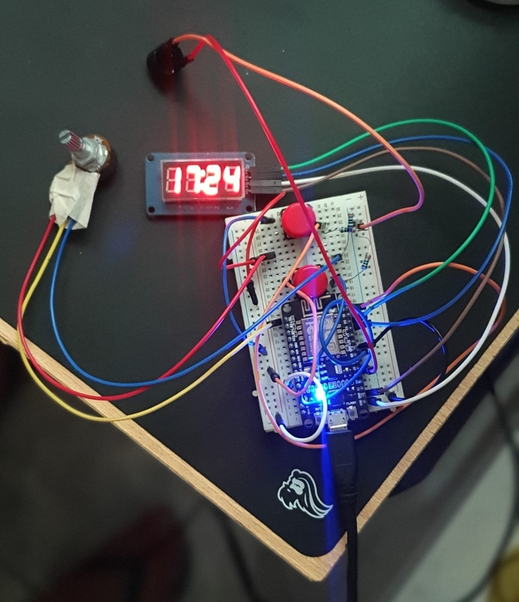

# Reloj Portátil con Temporizador Pomodoro

Este proyecto implementa un reloj portátil con un temporizador Pomodoro basado en NodeMCU ESP8266, utilizando una pantalla TM1637 de 4 dígitos, un potenciómetro para configuraciones y conectividad Wi-Fi con MQTT. 

## Características Principales

1. **Modo Reloj**: 
   - Visualiza la hora actual en la pantalla TM1637.
   - Configuración manual de la hora mediante un potenciómetro.

2. **Modo Pomodoro**:
   - Temporizador configurable para períodos de trabajo y descanso.
   - Alterna automáticamente entre sesiones de trabajo y descanso.
   - Alarma sonora al final de cada período.

3. **Conectividad Wi-Fi y MQTT**:
   - Permite configuraciones remotas del temporizador a través de tópicos MQTT.
   - Sincronización y control en tiempo real mediante mensajes MQTT.

4. **Controles Físicos**:
   - Botones para alternar entre modos y ajustar configuraciones.
   - Potenciómetro para definir tiempo de trabajo, descanso y ciclos Pomodoro.

## Componentes Utilizados

- NodeMCU ESP8266
- Pantalla TM1637 de 4 dígitos
- Potenciómetro conectado al pin A0
- Buzzer (para alarmas sonoras)
- Botones para cambiar entre modos y configurar el temporizador
- Conexión Wi-Fi para comunicación MQTT
- 4 resistores
- 14 cables

## Conexiones de Hardware

| Componente          | Pin NodeMCU ESP8266 |
|---------------------|---------------------|
| Pantalla CLK        | D2                 |
| Pantalla DIO        | D3                 |
| Potenciómetro       | A0                 |
| Botón de estado     | D0                 |
| Botón de modos      | D5                 |
| Buzzer              | D7                 |

## Configuración de Software

### Bibliotecas Necesarias

1. **[TM1637Display](https://github.com/avishorp/TM1637)**
   - Para controlar la pantalla TM1637.
2. **[PubSubClient](https://github.com/knolleary/pubsubclient)**
   - Para manejar la comunicación MQTT.
3. **ESP8266WiFi**:
   - Integrada en el framework de ESP8266 para conexión Wi-Fi.

### Configuración Wi-Fi

# Funcionalidades Clave

## Configuración del Reloj
- Usa el potenciómetro para ajustar la hora y los minutos.
- Presiona el botón de estado (`CHANGESTATE_BTN`) para alternar entre configuración de horas y minutos.

## Configuración del Temporizador Pomodoro
- Usa el potenciómetro para ajustar:
  - Número de ciclos (1-10).
  - Tiempo de descanso (1-15 minutos).
  - Tiempo de trabajo (10-59 minutos).
- El botón de estado (`CHANGESTATE_BTN`) confirma las configuraciones.

## Temporizador en Ejecución
- Alterna automáticamente entre períodos de trabajo y descanso.
- Emite una alarma al final de cada período.
- Configuración pausada si se recibe una orden MQTT o se presiona el botón de modos.

## Ejecución del Código
1. Conecta los componentes según la tabla de conexiones.
2. Sube el código al NodeMCU ESP8266 utilizando Arduino IDE.
3. Observa el funcionamiento en la pantalla TM1637 y controla mediante los botones o mensajes MQTT.

## Notas Adicionales
- El sistema utiliza un filtro exponencial para suavizar las lecturas del potenciómetro y evitar fluctuaciones en la configuración.
- Si el Wi-Fi no está disponible, el temporizador funciona de manera autónoma.

## Futuras Mejoras
- Implementación de una interfaz web para configuración y control.

## Licencia
Este proyecto se distribuye bajo la licencia MIT. Siéntete libre de usar y modificar el código para tus necesidades.

## Producto Final

